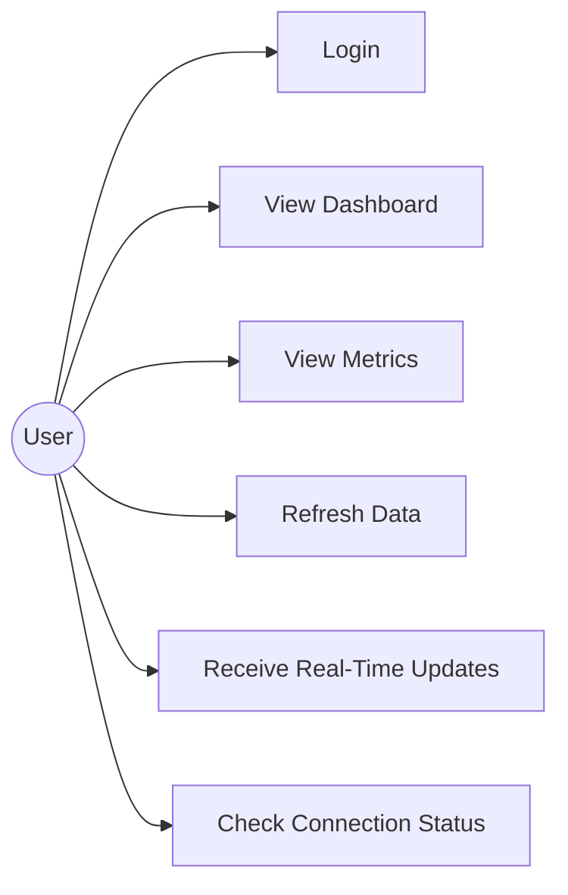
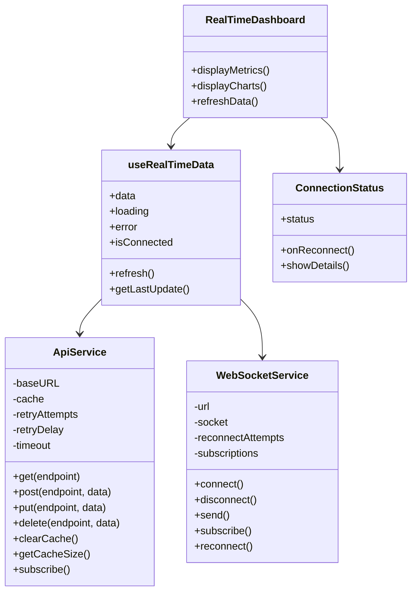
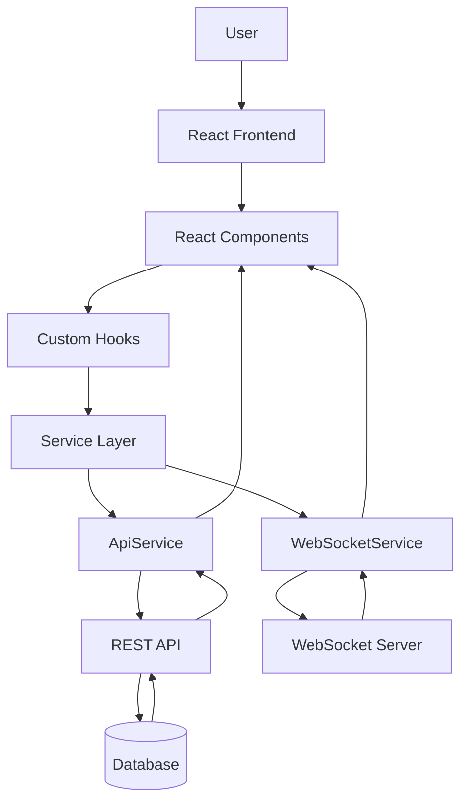
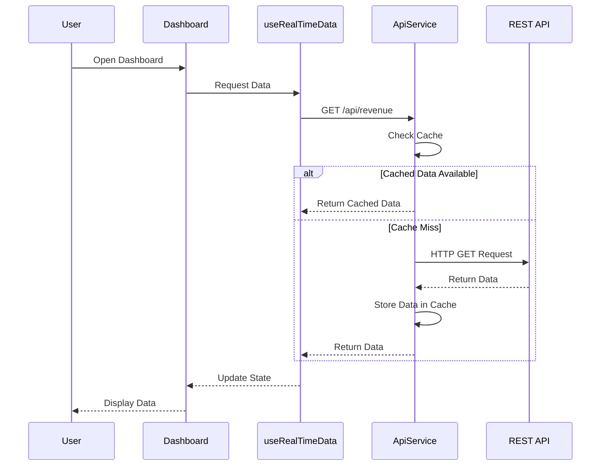
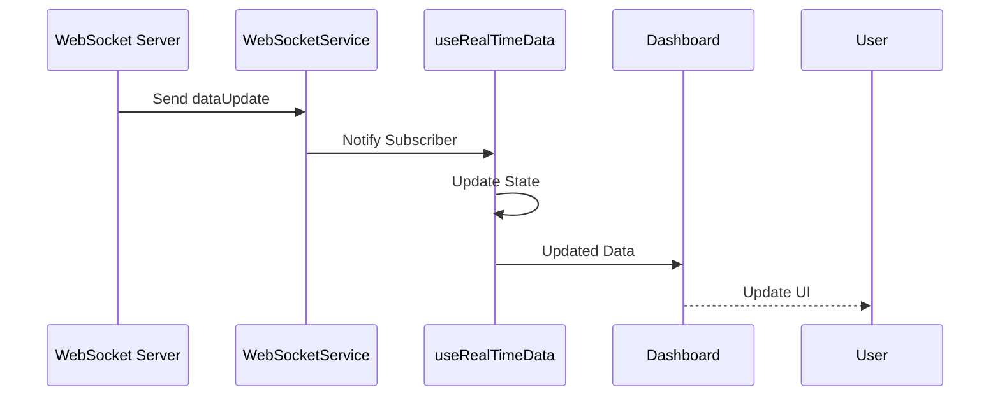
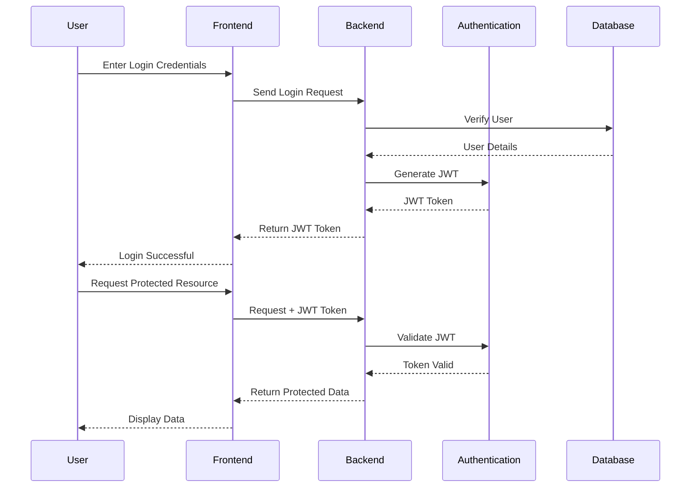
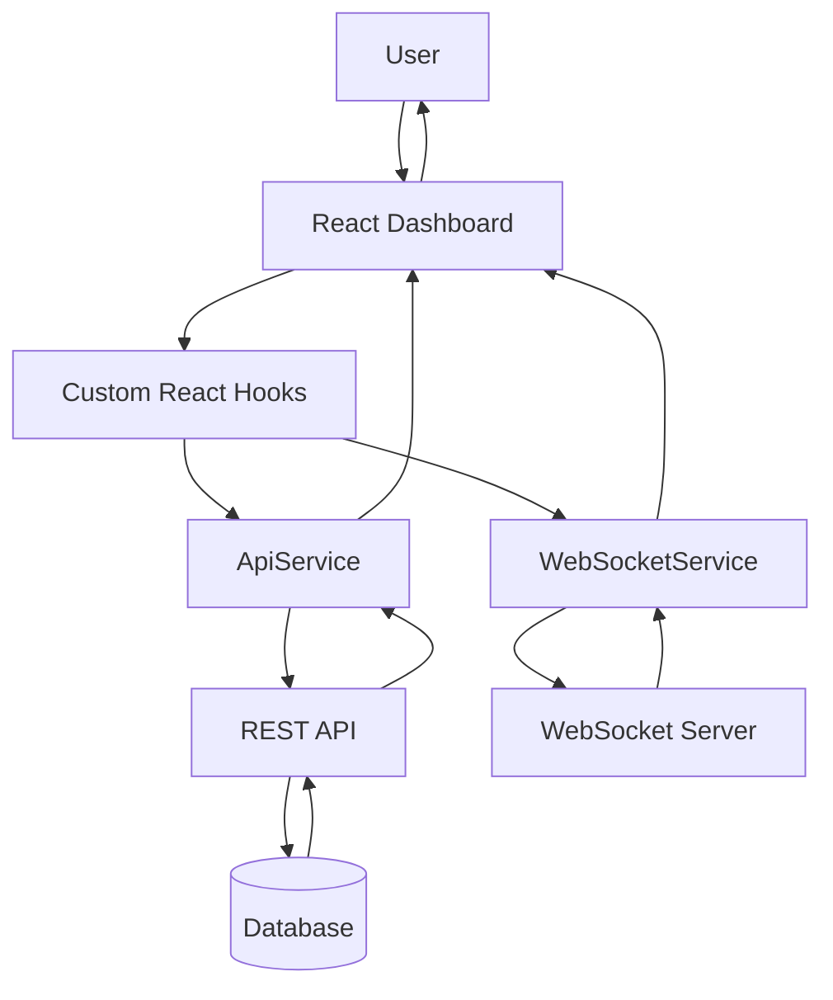
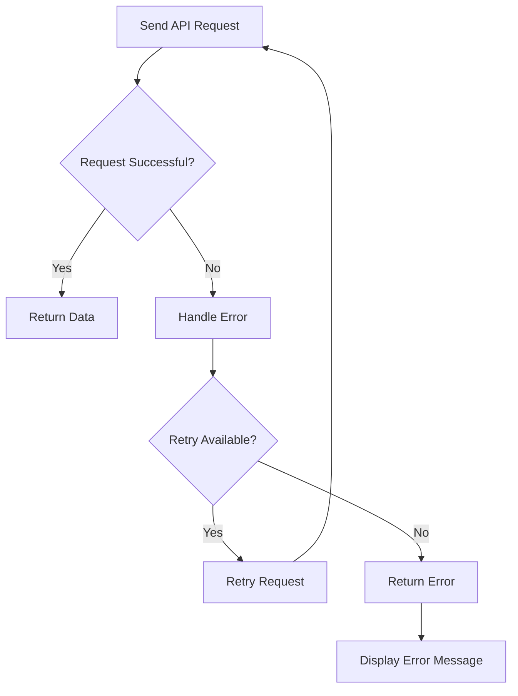
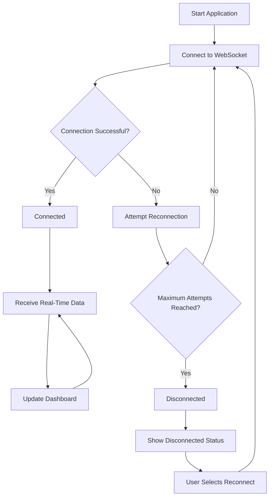
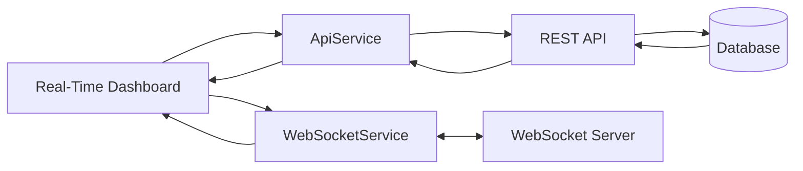

# UML Diagrams

This document contains UML diagrams for the SDA Training application.

---

## 1. Use Case Diagram

---

## 2. Class Diagram

---

## 3. System Architecture Diagram

---

## 4. API Request Sequence Diagram

---

## 5. WebSocket Sequence Diagram

---

## 6. Authentication Sequence Diagram

---

## 7. Data Flow Diagram

---

## 8. Error Handling Flow Diagram

---

## 9. WebSocket Connection and Reconnection Flow

---

## 10. API and WebSocket Relationship Diagram

---

## Summary

The UML documentation contains:

1. Use Case Diagram
2. Class Diagram
3. System Architecture Diagram
4. API Request Sequence Diagram
5. WebSocket Sequence Diagram
6. Authentication Sequence Diagram
7. Data Flow Diagram
8. Error Handling Flow Diagram
9. WebSocket Connection and Reconnection Flow
10. API and WebSocket Relationship Diagram