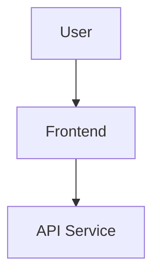

# Documentation Standards

This document defines the standards and guidelines used for creating, reviewing, and maintaining project documentation.

---

## 1. Writing Guidelines

The following guidelines should be followed when writing technical documentation:

- Use clear and concise language.
- Include code examples where appropriate.
- Provide sufficient context and background information.
- Keep documentation up to date with code changes.
- Use consistent formatting throughout the documentation.
- Avoid unnecessary technical jargon.
- Use meaningful headings and descriptions.
- Write instructions in a logical order.
- Use examples to explain complex concepts.
- Keep information accurate and easy to understand.

---

## 2. Structure Standards

All project documentation should follow a consistent structure.

### Headings

Use a consistent heading hierarchy:

```markdown
# Main Title

## Main Section

### Subsection

#### Detailed Section
```

### Code Blocks

Always use syntax highlighting for code examples.

```javascript
const message = "Hello World";
console.log(message);
```

For other languages, specify the appropriate language:

```python
print("Hello World")
```

### Tables

Use Markdown tables when presenting structured information.

| Field | Type | Description |
|---|---|---|
| name | string | User name |
| email | string | User email |
| role | string | User role |

### Links

Use links to related documentation when additional information is useful.

Example:

```markdown
[API Documentation](./api-documentation.md)
```

---

## 3. Documentation Organization

Project documentation should be organized into logical categories.

```text
docs/
├── system-architecture.md
├── api-documentation.md
├── sprint-planning.md
├── documentation-templates.md
└── documentation-standards.md
```

Diagrams should be stored separately:

```text
diagrams/
└── uml-diagrams.md
```

---

## 4. Version Control

Documentation should be managed using Git along with the source code.

### Version Control Guidelines

- Commit documentation changes with meaningful commit messages.
- Review documentation changes through Pull Requests when applicable.
- Keep documentation synchronized with the source code.
- Avoid committing outdated or duplicate documentation.
- Maintain documentation history through Git.

### Example Commit

```bash
git add week1/day6/docs/
git commit -m "Add Day 6 documentation"
```

---

## 5. Documentation Review Process

Documentation should be reviewed before it is considered complete.

### Step 1: Technical Review

Verify that:

- Technical information is accurate.
- Code examples are correct.
- API endpoints are documented correctly.
- Architecture diagrams match the system.
- Instructions are complete.

### Step 2: Content Review

Check that:

- All required sections are included.
- Information is easy to understand.
- Examples provide useful context.
- No important information is missing.

### Step 3: Grammar and Spelling Review

Check:

- Grammar
- Spelling
- Sentence structure
- Consistent terminology

### Step 4: Formatting Review

Verify:

- Heading hierarchy is consistent.
- Code blocks use correct syntax highlighting.
- Tables are formatted correctly.
- Links work correctly.
- Diagrams are readable.

### Step 5: Approval

After the review is complete:

1. Submit the documentation for peer review.
2. Address review comments.
3. Make required corrections.
4. Obtain approval.
5. Merge the documentation changes.

---

## 6. Documentation Quality Checklist

Before publishing documentation, verify the following:

- [ ] Documentation is clear and concise.
- [ ] Technical information is accurate.
- [ ] Code examples are functional.
- [ ] All required sections are included.
- [ ] Headings are structured correctly.
- [ ] Code blocks have syntax highlighting.
- [ ] Links work correctly.
- [ ] Diagrams are clear.
- [ ] Grammar and spelling have been checked.
- [ ] Documentation is consistent with the current code.
- [ ] Documentation has been reviewed.

---

## 7. Markdown Standards

The project uses Markdown for technical documentation.

Recommended practices:

- Use `#` for the document title.
- Use `##` for major sections.
- Use `###` for subsections.
- Use bullet lists for related items.
- Use numbered lists for sequential instructions.
- Use tables for structured information.
- Use fenced code blocks for source code.
- Use Mermaid blocks for supported diagrams.
- Use horizontal separators when separating major sections.

---

## 8. Diagram Standards

Architecture and UML diagrams should:

- Have a clear title.
- Represent the actual system or documented architecture.
- Use meaningful component names.
- Clearly show relationships between components.
- Avoid unnecessary complexity.
- Be easy to understand.
- Be updated when the architecture changes.

Example Mermaid structure:



---

## 9. Code Documentation Standards

Source code should contain documentation where it improves understanding.

Use comments to explain:

- Complex logic
- Important business rules
- Non-obvious implementation decisions
- Public functions and APIs

Avoid comments that simply repeat what the code already explains.

Example:

```javascript
// Retry failed requests using exponential backoff
// to avoid sending repeated requests too quickly.
```

---

## 10. API Documentation Standards

Every documented API endpoint should include:

- Endpoint name
- HTTP method
- Endpoint URL
- Description
- Authentication requirements
- Parameters
- Request example
- Success response
- Error response
- HTTP status codes

Example:

```text
GET /api/users
```

---

## 11. Component Documentation Standards

Component documentation should include:

- Component name
- Overview
- Props
- Usage
- Examples
- Styling information
- Accessibility information
- Testing information
- Current status

---

## 12. Maintenance

Documentation should be updated whenever:

- A feature is added.
- An API endpoint changes.
- A component changes.
- The architecture changes.
- A configuration changes.
- Development procedures change.

Keeping documentation updated prevents outdated information from being used by developers.

---

## 13. Review Workflow

The overall documentation workflow is:

```text
Create Documentation
        |
        v
Technical Review
        |
        v
Content Review
        |
        v
Grammar & Spelling Review
        |
        v
Formatting Review
        |
        v
Peer Review
        |
        v
Corrections
        |
        v
Approval
        |
        v
Commit & Merge
```

---

## Conclusion

Following consistent documentation standards makes the project easier to understand, maintain, review, and extend.

The standards defined in this document provide a common approach for writing technical documentation, creating diagrams, documenting APIs and components, managing documentation with Git, and reviewing documentation before approval.